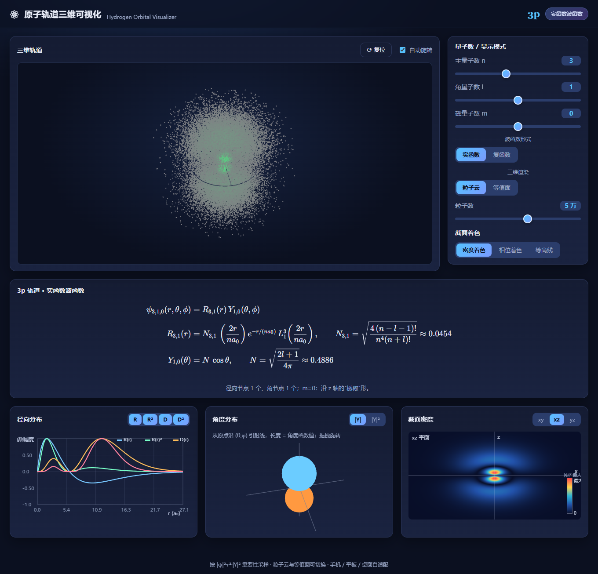
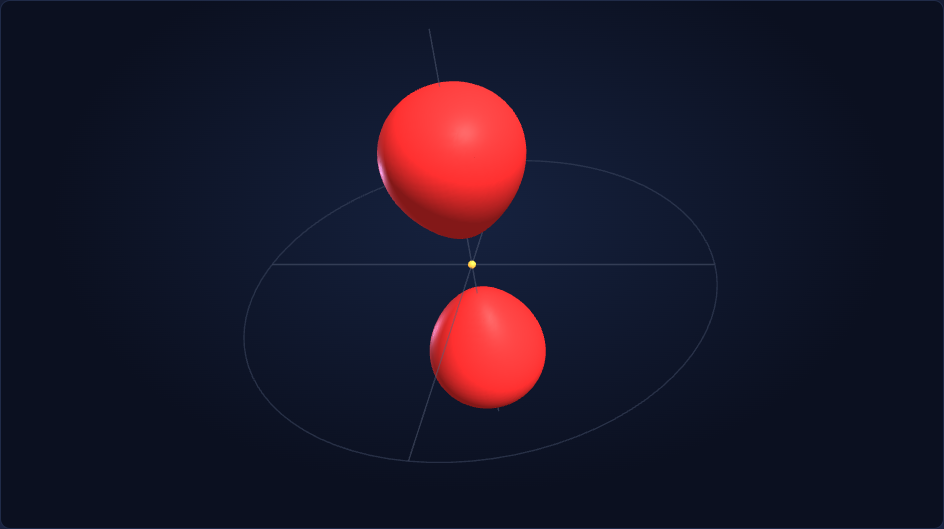
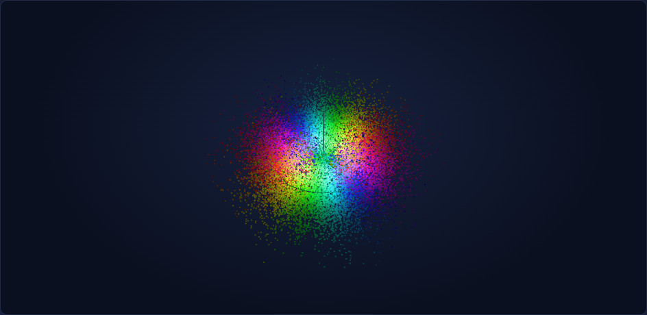
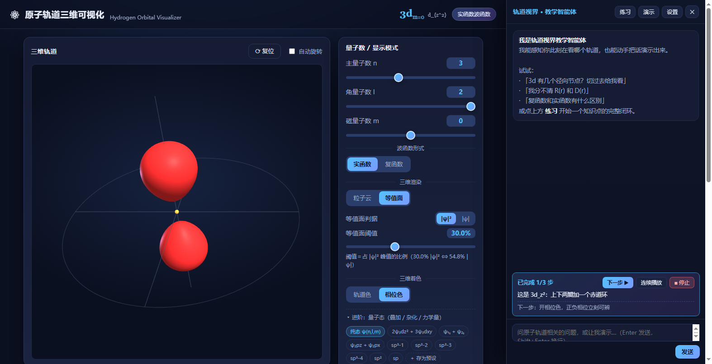

# 原子轨道三维可视化 · Hydrogen Orbital Visualizer

> 用三维图形直观展示**类氢原子波函数**的交互式教学工具，帮助学生与教育工作者理解抽象的量子力学概念。

## 🔗 链接

| | |
|---|---|
| 🌐 **在线体验** | <https://orbit.晶体.top> |
| 🅰️ 备用地址（Punycode） | <https://orbit.xn--tqqw77c.top> |
| 💻 **源码仓库** | <https://github.com/TungsticAcid/atom-orbit> |

> 「晶体」为中文域名（IDN），浏览器地址栏会显示中文，但底层实际是 `xn--tqqw77c`。
> 若在部分客户端/终端中无法打开中文形式，请使用上表的 **备用地址**。



## ✨ 功能特性

**量子数实时联动**：滑块与**数字输入框**双通道调节主量子数 `n`（1–6）、角量子数 `l`、磁量子数 `m`，`l` 上限随 `n`、`m` 范围随 `l` 自动收窄；输入框校验类型与范围，非法值标红且不改变状态。

**三维轨道渲染** — 按概率密度 `|ψ|²` 实时生成（**默认等值面**，可切粒子云）：

| 方式 | 说明 |
|---|---|
| **粒子云** | 按 `|ψ|²` 重要性采样数万个点，统计上即真实电子分布 |
| **等值面** | 在网格上以*四面体行进*提取等值面，**判据可切换 `\|ψ\|` / `\|ψ\|²`**，阈值可调 |

> **关于 `|ψ|` 与 `|ψ|²`**：`|ψ| = c` 与 `|ψ|² = c²` 是同一族曲面，故切换判据改变的是**读数的含义**而非形状——同一读数 `f`，按 `|ψ|²` 计为 `f·|ψ|²max`，按 `|ψ|` 计等价于 `f²·|ψ|²max`（`f<1` 时更小），因而得到**更大**的表面。面板实时显示换算，如 `30.0% |ψ|² ⟺ 54.8% |ψ|`。

两者共用同一套**三维着色**：**相位色**（实函数 → ±红/青正负瓣，复函数 → 彩虹相位）或**轨道色**（按 s/p/d/f 支壳层着色）。

**交互**：拖拽旋转、滚轮/双指缩放、右键（或 Shift+拖）平移、自动旋转、复位。旋转由**四元数轨道控制器**驱动——偏航绕**相机自身 Y（屏幕竖直）**、俯仰绕**相机自身 X（屏幕水平）**，全程四元数相乘、相机局部系累积，不经欧拉角，**原理上避免万向节锁**且支持自由翻滚。

<p align="center">
  
  <br>
  <em>3d<sub>z²</sub> 等值面（上下双瓣 + 赤道环，含两处径向节点形成的"洞"）</em>
</p>

**实函数 / 复函数双模式**——这是最有教学价值的一点：

- **实球谐** → 经典"瓣状"轨道（p<sub>z</sub>、p<sub>x</sub>、d<sub>xy</sub>、d<sub>z²</sub>…）
- **复球谐** → 密度绕 z 轴对称的"环 / 锥面"，并按相位 `arg ψ` 彩虹着色，直观呈现**相位缠绕**

<p align="center">
  
  <br>
  <em>复函数 3d (m=2)：赤道环状密度 + 相位沿方位角缠绕两周（arg = 2φ）</em>
</p>

**多维 2D 视图**（纯 Canvas 手绘，无图表库依赖）：

- **径向分布**：`R(r) / R(r)² / D(r) / D(r)²` 多选叠加，各自按峰值归一化
- **角度分布**：以 (θ, φ) 为自变量、自原点沿该方向引射线、长度为 `|Y|` 或 `|Y|²` 的**三维曲面**，可拖拽旋转。着色只由**实/复**决定——实函数按符号分色（+青 / −橙），复函数按相位 `arg Y` 彩虹着色；**与判据无关**：切 `|Y| ↔ |Y|²` 改的是曲面半径（轮廓），颜色不变。
- **截面密度**：`xy / xz / yz` 平面的三种模式——**密度着色** / **相位着色** / **无填色等高线**（8 层对数间距、标注数值、白线标出**节面** ψ=0）

**量子态：叠加 / 杂化 / 力学量**（收在控制面板底部的「进阶」折叠区，默认收起）：

- **叠加态** `ψ = Σ cᵢψᵢ`：任意复系数、自动归一化（`Σ|c|² = 1`）。核心教学点是**干涉项**——`|ψ|²` 并不等于各分量概率相加，组合态因此会出现单本征态没有的"斜向瓣"。
- **它还是不是定态**：各分量 `n` 相同（类氢原子能量只由 `n` 决定）⇒ 简并 ⇒ 组合态**仍是定态**，密度是不随时间变化的静态干涉图样；`n` 不同 ⇒ 非定态，密度随时间"呼吸"。动画参数用的是**相对相位** φ 而非真实时间（`ΔE ≈ 10.2 eV` ⇒ `ν ≈ 2.5×10¹⁵ Hz`，不可视化；而干涉图样只依赖相对相位）。
- **杂化预设**：`sp`（2 个，180°）、`sp²`（3 个，120° 共面）、`sp³`（4 个，109.5° 正四面体）全部给全，每个都标注了对应的波函数表达式。四个 sp³ 的 s 系数恒为 +½、三个 p 取正四面体的四个方向，因此**两两正交**（⟨hᵢ|hⱼ⟩ = 0）——这是"四个等价轨道"这句话的数学内容，逐个点选即可对照。
- **自定义预设**：`＋ 存为预设` 把当前组合存成面板上的一个按钮，可随时删（内置预设不可删）。
- **力学量**：`⟨E⟩`、`⟨L²⟩`、`⟨L_z⟩` 与 `L_z` 谱由解析式给出，并直接回答"这个组合是否定态"。

**其他**：KaTeX 实时渲染波函数公式（`P_l^m` 展开为显式多项式）；三维画布尺寸按窗口可用高度自适应（不写死像素，手机端正确处理地址栏收放）；桌面 / 平板 / 手机响应式自适配。

## 🤖 教学智能体（可选）

右下角的悬浮球打开侧边抽屉，可以问原子轨道相关的问题，**也可以让它把话直接演示出来**。它不是一个聊天框：能感知你此刻在看什么，也能动手改视图。

<p align="center">
  
  <br>
  <em>演示被拆成"分镜"逐步播放：走一步停下，由学生点「下一步」确认（也可连续播放 / 中途停止）</em>
</p>

**三层结构**

| 层 | 做什么 |
|---|---|
| **感知** | 每轮重采一次视图快照：量子数、波函数形式、渲染/着色/判据、图表设置、相机，以及**交互痕迹**（停留时长、切换次数、最近动作） |
| **动作** | 26 个**受控动作**（量子数、模式、等值面、图表标注、节点高亮、叠加态与预设…），每个都绑定一个知识点。这是智能体唯一的"手"，所有改动都要过校验、夹紧与限流 |
| **教学** | 知识库按需加载、出题与错因诊断、费曼复述评估、掌握度模型与推荐。答错时先给出"可视化诊断动作"——把视图切到能揭示错误根源的状态，而不是直接报答案 |

**演示节奏由学生掌握**：一次下发的动作会排成分镜队列，走一步停下等学生点「下一步」，每步配一句旁白（写清"这一步在做什么、要看哪里"）。学生也可以：

| 控制 | 作用 |
|---|---|
| **◀ 上一步** | 退回上一步**执行之前**的画面，随时重看。每步都存了快照，回退是精确还原（含叠加态系数、参考球/节面高亮这些辅助几何） |
| **下一步 ▶** | 前进（回到刚退掉的那一步也没问题） |
| **连续播放** | 一把放完，无需逐步确认 |
| **■ 停止** | 中止并清空 |
| **↻ 重新演示** | 全部走完后，从头重播同一条分镜 |

设置里可把默认方式切成自动连播。

**为什么不容易胡说**：

- **数值一律由程序算**。节点数、峰值半径、能级、力学量期望值全部走 `math.js` / `observables.js` 的确定性求值，模型**不得口算**，只负责组织语言。
- **叠加态系数可自定义**。`ψ = Σ cᵢψᵢ` 任意系数、自动归一化，可构造"不等性杂化"这类非等价组合；现场调好的系数能**存成面板上的按钮**，下次一键复现。
- **边界照实说**。本模块只做**原子轨道**的叠加。水分子 sp³ 不等性杂化的真实系数须由量子化学计算给出，模型会用**示意系数**演示"系数不等 ⇒ 轨道不再等价"这条因果链，并明确标注"这是示意值"。涉及晶体堆积、分子对称性的问题会建议改用其他模块。

> ⚠️ **智能体需要自备 API Key（BYOK）**。可视化部分完全离线；智能体部分需要你填自己的模型接入点与密钥，本工具不提供额度。密钥只存本机浏览器（localStorage），只发往你填写的接入点，不经过任何第三方中转。未配置密钥时，**演示模式**（预置脚本回放）与全部可视化功能仍可正常使用，且不消耗 token。
>
> 💡 若模型回复出现"没有正文"：那是单次输出上限被触发了。可在「设置 → 输出上限 max_tokens」调大后重试。这种情况界面会明确提示，并附上诊断证据（`finish_reason` 与 token 用量），不会给你一个空白气泡。**注意不要把 `max_tokens` 设得超过所用模型的上限**——虽然服务端拒绝时会自动去掉该参数重试一次，但那样就失去了成本闸门。

## 🚀 快速开始

**在线使用**：直接打开 <https://orbit.晶体.top>，无需安装。

**本地使用（离线）**：克隆后双击 `H5/index.html` 即可。

项目把依赖（Three.js / KaTeX）本地化在 `libs/` 并采用**全局构建**，因此 `file://` 双击即可离线运行，**无需联网、无需服务器**。

> 离线指的是可视化部分（渲染、图表、公式、演示脚本全部在本地算完）。
> 只有「教学智能体」需要联网访问你自备的模型接入点——不配置密钥时其余功能不受影响。

```bash
git clone https://github.com/TungsticAcid/atom-orbit.git
cd atom-orbit/H5
# 双击 index.html，或起一个静态服务器：
python -m http.server 8000    # 然后访问 http://localhost:8000
```

## 📁 目录结构

```
atom-orbit/
├── index.html          # Vercel 入口：跳转到 H5/index.html
├── docs/               # README 用的预览图
├── LICENSE             # MIT
└── H5/                 # 应用本体
    ├── index.html          # 单页入口（布局 + 引入脚本）
    ├── README.md           # 应用详细文档
    ├── libs/               # 本地化依赖（离线必需）
    │   ├── three.min.js        # Three.js r147 全局构建
    │   ├── katex.min.css/js    # 公式渲染
    │   └── fonts/              # KaTeX woff2 字库
    ├── assets/             # 智能体图标、教材对照表图片
    ├── css/
    │   ├── style.css       # 暗色主题 + 响应式
    │   └── agent.css       # 智能体：悬浮球 / 抽屉 / 消息渲染
    ├── js/
    │   ├── math.js         # 纯 JS 物理/数学引擎
    │   ├── layout.js       # 视口自适应：按窗口可用高度算三维画布尺寸
    │   ├── render3d.js     # Three.js：粒子云 + 等值面 + 角度曲面
    │   ├── charts.js       # Canvas 2D：径向 / 截面（含等高线）
    │   ├── formula.js      # KaTeX 公式与 P 多项式展开
    │   ├── main.js         # 主控制器：UI 绑定、状态、节流
    │   └── agent/          # 教学智能体（见下节）
    │       ├── agent-core.js       # ReAct 对话循环 + 系统提示
    │       ├── scene-bridge.js     # 受控动作词汇表（智能体唯一的"手"）
    │       ├── tool-registry.js    # 工具契约（查 / 演 / 教 / 评）
    │       ├── perception-snapshot.js  # 感知层：视图快照 + 交互痕迹
    │       ├── question-engine.js  # 出题 / 讲解 / 费曼复述评估
    │       ├── error-diagnosis.js  # 错因分类 + 可视化诊断动作
    │       └── …                   # 掌握度模型、设置、面板、演示模式等
    ├── knowledge/          # 知识库条目（按 id 渐进式加载）
    └── skills/             # 教学技能脚本（费曼 / 苏格拉底追问…）
```

## 🧮 物理与数学约定

- 玻尔半径 `a₀ = 1`（长度以 a₀ 为单位）；球坐标 `(r, θ, φ)`，**z 为量化轴**（三维视图中竖直）。
- 波函数 `ψ_{n,l,m} = R_{n,l}(r)·Y_{l,m}(θ,φ)`，均为归一化形式（`∫|ψ|²dV = 1`）。
- **径向**：`R_{n,l}` 含广义拉盖尔多项式 `L_{n-l-1}^{2l+1}`；`D(r) = r²R(r)²` 为径向分布函数。
- **球谐**：复模式 `Y_l^m = N·P_l^{|m|}(cosθ)·e^{imφ}`（含 Condon–Shortley 相因子）；实模式由复球谐线性组合得到 `cos(mφ)` / `sin(mφ)` 型实轨道。
- 全部数学为**纯 JS 递推实现**（拉盖尔 / 勒让德 / 球谐、复数运算）。`n ≤ 6` 时阶乘不越界、float64 精度充足。

## ⚙️ 关键技术选型

| 决策 | 原因 |
|---|---|
| 纯 JS 手写数学（弃 NumPy / Pyodide） | 移动端秒开；所需数学仅需少量递推即可精确实现，无需 ~15MB 的 WASM 运行时 |
| Three.js **r147 全局构建** | r148 起非模块 `OrbitControls` 被移除，且新版为 ES Module（`file://` 下被 CORS 拦截）；全局构建可双击离线运行 |
| **四元数轨道控制器**（不用 `OrbitControls`） | 球坐标 + up 向量在视线与 up 平行时存在万向节锁；改为相机局部系四元数累积（偏航绕相机自身 Y=屏幕竖直、俯仰绕相机自身 X=屏幕水平），全程不经欧拉角、无奇异点，支持自由翻滚 |
| 等值面用 marching **tetrahedra**（非 cubes） | 免去 256×16 巨型查找表，规则简单、必定正确；配合顶点焊接 + Taubin 平滑 + 一致绕向保证表面光滑 |
| 2D 图表手绘 Canvas | 三种图表形态各异，手绘控制力强、零额外依赖、与暗色主题统一 |
| 三维画布高度由 JS 按视口算（`layout.js`），不写死 | 写死 `clamp(280px, 44vh, 470px)` 时"高度=窗口高"这个直觉等式从不成立——顶端还有顶栏、卡片标题、内边距。改为量出画布顶端在文档中的位置，用 `视口可见高 − 该位置 − 余量` 下发 CSS 变量；移动端读 `visualViewport`，正确处理地址栏收放 |
| 智能体**只通过受控动作词汇表**改视图 | 模型输出不可信。每个动作都经类型/范围校验、夹紧与限流，且绑定知识点——动作因此可解释、可审计、可复现；模型拿不到任何直接操作 DOM / 渲染器的口子 |
| 数值一律程序算，模型只组织语言 | LLM 口算节点数、峰值半径、期望值必错。工具返回的是"事实"，从结构上消除数值幻觉 |
| 知识库 / 技能**渐进式披露** | 正文常驻系统提示会挤占上下文、且抬高每次调用的成本。提示里只放条目清单与一句话说明，需要时再 `loadKnowledge` / `loadSkill` 拉取正文 |
| 智能体动作**排成分镜队列、由用户逐步确认** | 一次下发的动作若同步 tight-loop 执行，十几个动作会在几十毫秒内全落地，学生只看到最终画面、中间每步都"闪"过去；而固定时长的自动连播又不由学生掌握节奏。改为"入队 + 立即返回 + 闸门等待"：工具不阻塞对话循环，节奏交给学生 |
| 演示预设可增删（存 localStorage） | 内置预设表达不了"不等性杂化"这类系数不等的组合。智能体现场构造的示意系数对话一过就没了，存成预设后学生可一键复现、反复对照——从"一次回答"变成"留在工具里的教具" |
| **BYOK**（Bring Your Own Key） | 不代管密钥与额度，也就不承担密钥保管与滥用的责任。密钥只存本机，只发往使用者自己填写的接入点 |

## 📚 参考书目

本项目的物理内容、公式核对与知识库条目编制参照以下教材（知识库条目的 `source` 字段以方括号代号标注来源章节）：

| 代号 | 文献 |
|---|---|
| — | 《物质结构基本原理》（第 4 版）．张冬菊、郭用猷 主编，刘艳华 副主编．北京：高等教育出版社，2026.6．ISBN 978-7-04-066955-8 |
| `[周]` | 周公度、段连运．《结构化学基础》．北京大学出版社 |
| `[江]` | 江元生．《结构化学》 |
| `[徐]` | 徐光宪、黎乐民．《量子化学：基本原理和从头计算法》 |
| `[Sz]` | A. Szabo, N. S. Ostlund. *Modern Quantum Chemistry* |
| `[At]` | P. Atkins, J. de Paula. *Physical Chemistry* |

> 应用内「教材对照表」（R 表 / Y 表）对应上表第一本书的表 2.2.4 与表 2.2.3。
> 该功能依赖两张表格图片，图片未随仓库分发，缺失时面板会给出查阅指引。

## 📄 许可

[MIT License](LICENSE) © 2026 TungsticAcid
