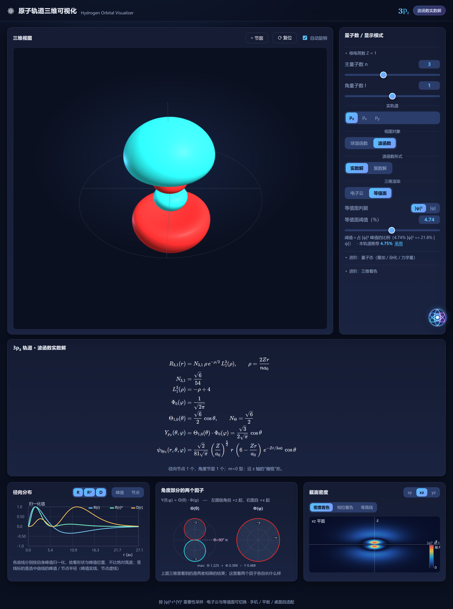
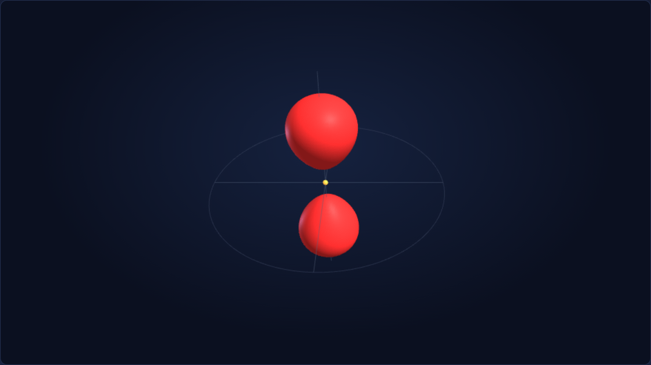
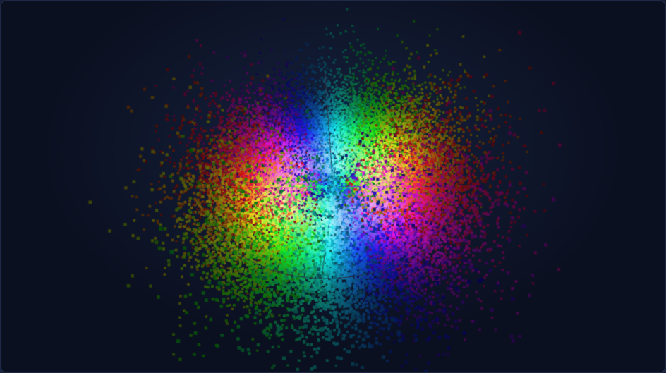
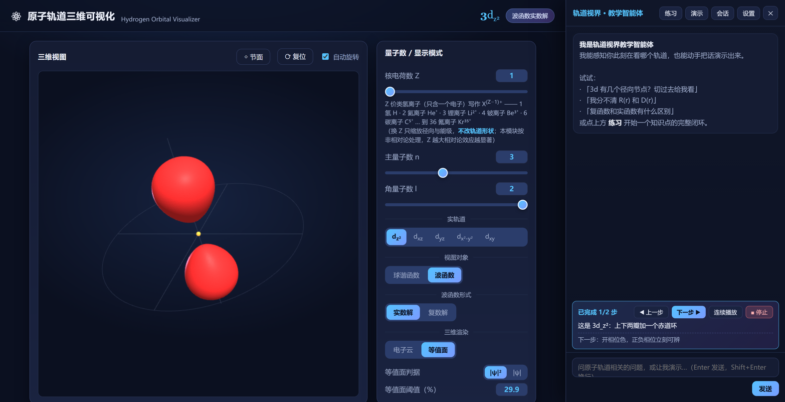

# 原子轨道三维可视化 · Hydrogen-like Atomic Orbital Visualizer

> 用三维图形直观展示**类氢原子波函数**的交互式教学工具，帮助学生与教育工作者理解抽象的量子力学概念。核电荷数 `Z` 可在 **1–36** 之间调节（H → Kr³⁵⁺）——类氢与氢之间只差一条标度关系（`r → r/Z`、`E ∝ Z²/n²`），所以换 `Z` 只缩放径向尺度与能级，**角度部分与 `Z` 完全无关**。

## 🔗 链接

| | |
|---|---|
| 🌐 **在线体验** | <https://orbit.晶体.top> |
| 🅰️ 备用地址（Punycode） | <https://orbit.xn--tqqw77c.top> |
| 💻 **源码仓库** | <https://github.com/TungsticAcid/atom-orbit> |

> 「晶体」为中文域名（IDN），浏览器地址栏会显示中文，但底层实际是 `xn--tqqw77c`。
> 若在部分客户端/终端中无法打开中文形式，请使用上表的 **备用地址**。



## ✨ 功能特性

**量子数实时联动**：滑块与**数字输入框**双通道调节主量子数 `n`（1–6）、角量子数 `l`，以及**实轨道**逐项选择（实数解档按化学名给按钮：`p_z / p_x / p_y`、`d_z² / d_xz / …`，直到 `l = 5` 的 11 个直角坐标多项式）；`l` 上限随 `n`、`m` 范围随 `l` 自动收窄；输入框校验类型与范围，非法值标红且不改变状态。

**核电荷数 `Z`**（1–36）另收在面板顶部的**折叠区**里——它决定"这是哪个原子"，但默认 `Z = 1`（氢）已覆盖绝大多数教学场景，摊在面板上会占掉一大块而学生一节课未必动它一次。折叠后**标题仍写着当前值**（`▸ 核电荷数 Z = 1`）：`Z` 会静默改掉所有尺度与能级（`r → r/Z`、`E ∝ Z²`），不写出来，学生改过再折回去就想不起来画面为什么变了。

**顶栏右上角显示"当前正在看的那个数学对象的符号"**：球谐档写 `Y`（复解连写作 `Y_{1-1}`，实解档维持轨道名 `Y_{p_z}`），波函数档写 `ψ`（实解档 `ψ_{3d_{z²}}` 多级下标、复解档 `ψ_{322}`）。徽标同步写"球谐 / 空间波函数 · 实数解 / 复数解"（与面板上那个按钮**逐字一致**）。这里原先显示的是**轨道名**（`3d_z²`），而三维里画的可能是 `Y`、也可能是 `ψ`，名字没交代"看的是哪个量"——于是出现"三维里画的是 Y、顶栏却写 3p_z"这种图文不符。符号现在由 `formula.js` 的 `symbolHtml()` **独家**构造（此前散在三处，改一处漏两处）。

**三维视图有两个档位**（面板「视图对象」切换）——两者共用同一个三维窗口、同一套相机与操作（旋转 / 缩放 / 平移 / 自动旋转 / 复位），但底层是**两套几何**：

| 档位 | 画什么 | 说明 |
|---|---|---|
| **球谐函数**（角度部分） | 极坐标曲面 `r = \|Y\|` 或 `\|Y\|²` | 解析形状直接三角化，与波函数等值面**共用同一套光照材质**（`MeshStandardMaterial` + 顶点法线），两档观感一致。着色由判据派生：取 `\|Y\|` 且为实数解时按 `sign(Y)` 分 ±红/青，取 `\|Y\|²` 时纯色，复数解一律纯色。**p_z 画出来就是两个相切的球面**，这里能当场演示；它只依赖 `l`、`m`、**与 `n` 无关**，切 n 时曲面纹丝不动（这正是"2p_z 与 3p_z 角度分布相同"的可视化证据） |
| **空间波函数**（完整 ψ） | `\|ψ\|²` 的**等值面**（默认）或**电子云** | 见下表。**「三维渲染」（电子云 / 等值面）只在判据取 `\|ψ\|²` 时出现**：电子云就是按 `\|ψ\|²` 重要性采样出的点云，这个概念依附于 `\|ψ\|²`；判据取 `ψ` 时没有电子云可言，程序会把渲染方式拉回等值面并把那一组控件收起 |

| 方式 | 说明 |
|---|---|
| **电子云** | 按 `\|ψ\|²` 重要性采样数万个点，统计上即真实电子分布 |
| **等值面** | 在网格上以*四面体行进*提取等值面，**判据可切换 `\|ψ\|` / `\|ψ\|²`**，阈值可调 |

**渲染不卡顿**：一次重建（换轨道 / 改阈值）会被切成小片摊到多帧里跑，所以**画面始终在动、结果慢慢长出来**，而不是整屏卡死几百毫秒后突然出现；自动旋转与按钮全程不受影响。拖动阈值 / 量子数滑块时自动降到 40³ 且跳过局部精细化，松手后回到全分辨率并补上细颈 —— 拖动过程中画面以约 10 次/秒持续更新（实测帧间隔上限 17ms）。切换曲面时**旧的先留着、新的整块就位才换**，不会出现空帧或"缺一块"的中间态。

> **关于 `|ψ|` 与 `|ψ|²`**：`|ψ| = c` 与 `|ψ|² = c²` 是同一族曲面，故切换判据改变的是**读数的含义**而非形状——同一读数 `f`，按 `|ψ|²` 计为 `f·|ψ|²max`，按 `|ψ|` 计等价于 `f²·|ψ|²max`（`f<1` 时更小），因而得到**更大**的表面。面板实时显示换算，如 `30.0% |ψ|² ⟺ 54.8% |ψ|`。

> **阈值范围与推荐值**：阈值滑块用**对数刻度**覆盖 `0.3%–80%`——取对数刻度就要看**中点落在哪**，`0.3%×80%` 的几何平均是 **4.9%**，正好落在 3p/4p/4d 这些常用轨道推荐值的左右（原量程 `0.02%–80%` 的中点是 1.26%，等于把滑块正中间浪费在了几乎没人用的量级上）。下限也不再压到 0.02%：实测各轨道"看全所有壳层"所需的最低阈值是 6s 的 0.04%，而 0.04% 画出来是一团弥散的巨球、教学上反而不如只看内几层；0.3% 已能显出 **3s 的三层壳**。面板会按当前轨道给出**推荐阈值**（取该轨道最弱一层径向壳峰值的 40%）并提供一键采用——因为各层壳的峰值相差悬殊（3p `100/11.9`、4p `100/11.1/4.2`、5d `100/17.4/8.1`、4s `100/1.8/0.42/0.18`），任何一个固定默认值都必然在某些轨道上把外层壳整片切掉；4s/5s/6s 的推荐值会被下限顶住，此时提示行明确标注"（已到下限）"，不把一个被夹住的数字当成推荐值报给使用者。

**三维着色不是独立开关，而是判据的推论**：画 `|ψ|²` 时函数处处非负，本就没有正负可谈（纯色）；画 `ψ`（或 `Y`）时才谈得上符号。三条规则 —— **判据取平方 → 纯色**（按 s/p/d/f 支壳层上色）；**判据不取平方且为实数解 → 双色**（按 `sign ψ` 分 ±红/青，判据是**完整 ψ 的符号** `sign(R(r)·Y)`，故径向节点处的符号翻转也能看到）；**一切复数解 → 一律纯色**（复解的 `arg ψ` 是绕 z 轴**连续缠绕**，不是两个值，用双色编码它是错的）。s 轨道（l=0）不特判：1s 的 ψ 处处为正、自然得到纯色，而 2s / 3s 有径向节点、ψ 确实变号，那时内外壳异色是物理，不该被压掉。三维、球谐曲面、截面、以及左下角那张 Θ/Φ 卡，四处的配色**同源**（共用同一个 `phaseColor` 出口）。

> 这一项原先是面板底部「进阶：三维着色」里的一个双选项开关，已删除。删它的理由是它带来一个隐蔽问题：判据按钮只在「等值面」档显示，而电子云的颜色也由它决定 —— 等于让一个**看不见的选项**决定可见画面。改由判据派生后两者合一，判据按钮也已移出「等值面」那一组，电子云与等值面两档都看得见。

**交互**：拖拽旋转、滚轮/双指缩放、右键（或 Shift+拖）平移、自动旋转、复位。旋转由**四元数轨道控制器**驱动——偏航绕**相机自身 Y（屏幕竖直）**、俯仰绕**相机自身 X（屏幕水平）**，全程四元数相乘、相机局部系累积，不经欧拉角，**原理上避免万向节锁**且支持自由翻滚。

<p align="center">
  
  <br>
  <em>3d<sub>z²</sub> 等值面：上下双瓣。它的径向节点数是 <code>n−l−1 = 0</code>（3d 的第一层壳），所以两瓣之间没有"套娃"式的洞；两瓣同色则是因为相位色取的是<strong>完整 ψ</strong> 的符号 <code>sign(R·Y)</code>——只看 Y 会漏掉径向部分的贡献。</em>
</p>

**◇ 节面高亮**：三维卡片右上角那枚按钮把节点公式变成**可点亮、可数的几何对象** —— 径向节面画成以核为中心的球壳，角度节面画成过核的**半透明填充面**（θ 方向的锥面、φ 方向的平面；θ=90° 的退化锥就是 xy 平面，按平面画）。画布左下角的标签写的是**当前轨道真有几种节面**（`径向节面 ×2高亮`、`角度节面 ×1 + 径向节面 ×1高亮`…），并随轨道实时更新 —— 数量就是 `n−l−1` 与 `l`。

**波函数实数解 / 复数解双模式**——这是最有教学价值的一点：

- **实数解** → 经典"瓣状"轨道（p<sub>z</sub>、p<sub>x</sub>、d<sub>xy</sub>、d<sub>z²</sub>…），界面上**按化学名逐个选**，不出现 `m`
- **复数解** → 密度绕 z 轴对称的"环 / 锥面"，**按 `m` 选**（`m` 在这里名副其实：它是 `L̂z` 的本征值指标）；要看**相位缠绕**就切到截面卡选 `ψ`（xy 平面）——绕原点一周，相位正好走完 `|m|` 个整周期

<p align="center">
  
  <br>
  <em>复数解 3d (m=2)：赤道环状密度 + 相位沿方位角缠绕两周（arg = 2φ）</em>
</p>

**多维 2D 视图**（纯 Canvas 手绘，无图表库依赖）：

- **径向分布**：`R(r) / R(r)² / D(r)` 多选叠加，各自按峰值归一化。**只有这三个量**——`D(r) ≥ 0` 恒成立，再平方不改变极值点与零点，`D(r)²` 没有任何独立的物理含义，放在图里只会让学生以为漏学了一个量（知识库条目同样只讲这三个，`D(r)²` 既不在界面里、也不在讲解里）。
- **角度部分的两个因子**：把分离变量的第二步 `Y(θ,φ) = Θ(θ)·Φ(φ)` 画出来——**左 Θ、右 Φ、中间一个「×」**，底部给出 `max|Θ| × max|Φ| = max|Y|` 的真实数字（如 3p_z 的 `1.225 × 0.399 = 0.489`）。两个因子**各自归一化**（`∫|Θ|²sinθdθ = 1`、`∫|Φ|²dφ = 1`），所以乘积逐点等于 `Y`，那行数字不是示意而是可核对的恒等式。Θ 画在 xz 平面（极角自 **+z** 起），Φ 画在 xy 平面（极角自 **+x** 起）——两个基准不同，图上各自标注，并用虚线标出**角节面所在的角度**（`θ=55°`、`φ=…`）。复数解档下 `|Φ|` 是常数（**一个圆**），下标是 `m`；实数解档标 `Φ_{±m}`，公式区并写出它**由两个复解组合而来**（`Φ_{±m} = (1/√2)(Φ_{+m} + Φ_{−m})`）——实解不是"另一个量子数的解"，这一点在公式上直接就看得见。这张卡的着色与三维**同源**（由判据派生的同一条规则），不是一个需要单独设置的开关。
- **截面**：`xy / xz / yz` 平面的三种模式——**`|ψ|²`**（按该点密度填色）/ **`ψ`**（按该点相位填色）/ **无填色等高线**（8 层对数间距、标注数值、白线标出**节面** ψ=0）。前两档叠一条**白虚线 = 当前等值面对应的等值线**，把"三维的面"与"截面的线"对上号；恰为节面时整面涂纯色（那里相位是数值零的辐角，照常上色会画出一片噪声）。

**量子态（叠加 / 力学量）：整块暂时下架。** 面板底部的「进阶：量子态」折叠区已**不再挂载**（不是 `display:none`，是根本没建那个 `<details>` —— 否则"展开后露出半截""键盘还能 Tab 进去"这类路径仍然存在）。智能体侧的 7 个叠加态动作（`setSuperposition` / `setCoefficient` / `setRelPhase` / `clearSuperposition` / `loadPreset` / `savePreset` / `deletePreset`）也从**工具清单与参数校验**里一并撤销：界面上藏了、接口没藏，等于没藏。代码**全部保留**（编辑器、预设表、动作实现都在），日后把 `state-editor.js` 的 `EDITOR_HIDDEN` 与 `scene-bridge.js` 的 `HIDDEN_ACTIONS` 清掉即可恢复。杂化的 9 个预设已在上一轮按同一套做法先下架（`hybrid: true` 标记 + 面板 / 预设匹配 / 工具清单三处过滤 + `validate` 拒绝）。

> 以下为下架前的功能记录，保留备查：

- **叠加态** `ψ = Σ cᵢψᵢ`：任意复系数，程序把你给的系数**等比归一化**到 `Σ|cᵢ|² = 1`（本程序的基组是同一中心的原子轨道、彼此正交归一，故归一化条件就是这一条；一般式要写成 `Σᵢⱼ cᵢ*cⱼSᵢⱼ = 1`）。核心教学点是**干涉项**——`|ψ|²` 并不等于各分量概率相加，组合态因此会出现单本征态没有的"斜向瓣"。
- **`|cᵢ|²` 该怎么念**：它是**投影到该分量**的概率；只有当该分量确实是**所测力学量的本征态**时，它才等于"测到那个本征值"的概率。反例就在本程序里：`p_x = (p₊ + p₋)/√2` 测 `L_z` 得到 ±ℏ 各 1/2（成立），但测**能量**时两个分量简并、概率恒为 1，`|cᵢ|²` 与能量概率无关。
- **它还是不是定态**：各分量 `n` 相同（类氢能量只由 `n` 与 `Z` 决定，`E = −13.6 Z²/n²`）⇒ 简并 ⇒ 组合态**仍是定态**，密度是不随时间变化的静态干涉图样；`n` 不同 ⇒ 非定态，密度随时间"呼吸"。动画参数用的是**相对相位** φ 而非真实时间（`ΔE ≈ 10.2 eV` ⇒ `ν ≈ 2.5×10¹⁵ Hz`，不可视化；而干涉图样只依赖相对相位）。
- **杂化预设**（`sp` / `sp²` / `sp³` 共 9 个）：**暂时下架**，功能在整改中。代码与预设定义仍保留在 `state-editor.js` 里（打了 `hybrid: true` 标记），日后撤掉过滤即可恢复；界面的预设按钮、智能体的 `loadPreset` 工具清单与参数校验三处**同时**做了拦截。
- **自定义预设**：`＋ 存为预设` 把当前组合存成面板上的一个按钮，可随时删（内置预设不可删）。
- **力学量**：`⟨E⟩`、`⟨L²⟩`、`⟨L_z⟩` 与 `L_z` 谱由解析式给出，并直接回答"这个组合是否定态"。

**排版口径**（全项目一致）：**变量斜体、常数与函数名正体** —— ψ、Y、R、Θ、Φ、r、θ、φ、x、y、z、量子数 `n/l/m/Z`、下标里的方向坐标…一律斜体；`i`（虚数单位）、`e`（自然对数底）、`cos/sin`、支壳层字母（`ψ_{3p_x}` 里的 `p`）、数字与括号一律正体。公式里由 KaTeX 的 `\mathrm{}` / `\mathit{}` 保证，面板标签、顶栏符号、图表 canvas 文字里由显式标记保证（canvas 那一路见 `charts.js` 的 `fillMath`）。

**其他**：KaTeX 实时渲染波函数公式，**只给 5 行**（R / Φ / Θ / Y / ψ —— 归一化常数、拉盖尔多项式乃至中间记号 ρ 一律**代入**，整行只含 r、Z、a₀，不再单列成行）；`P_l^m` 展开为显式多项式；三维画布尺寸按窗口可用高度自适应（不写死像素，手机端正确处理地址栏收放），右侧控制面板与之**等高**、内容超出时在面板内部滚动（窄屏切单列时自动取消等高）；桌面 / 平板 / 手机响应式自适配。

## 🤖 教学智能体（可选）

右下角的悬浮球打开侧边抽屉，可以问原子轨道相关的问题，**也可以让它把话直接演示出来**。它不是一个聊天框：能感知你此刻在看什么，也能动手改视图。

<p align="center">
  
  <br>
  <em>演示被拆成"分镜"逐步播放：走一步停下，由学生点「下一步」确认（也可连续播放 / 中途停止）</em>
</p>

**三层结构**

| 层 | 做什么 |
|---|---|
| **感知** | 每轮重采一次视图快照：量子数、波函数形式、渲染/着色/判据、图表设置、相机，以及**交互痕迹**（停留时长、切换次数、最近动作）；另附**当前演示与演示清单**（哪条演示、走到第几步、一共有哪几条）—— 没有这一行，智能体接不住学生说的"刚才那个演示第 2 步" |
| **动作** | 23 个**受控动作**（量子数、模式、等值面、图表标注、节点高亮…），每个都绑定一个知识点。这是智能体唯一的"手"，所有改动都要过校验、夹紧与限流。（另有 7 个叠加态动作已随「量子态」整块下架，见下文。） |
| **教学** | 知识库按需加载、出题与错因诊断、费曼复述评估、掌握度模型与推荐。答错时先给出"可视化诊断动作"——把视图切到能揭示错误根源的状态，而不是直接报答案 |

**演示节奏由学生掌握**：一次下发的动作会排成分镜队列，走一步停下等学生点「下一步」，每步配一句旁白（写清"这一步在做什么、要看哪里"）。学生也可以：

| 控制 | 作用 |
|---|---|
| **◀ 上一步** | 退回上一步**执行之前**的画面，随时重看。每步都存了快照，回退是精确还原（含叠加态系数、参考球/节面高亮这些辅助几何）。**连播播完之后照样能退回去重看**——判据是"循环是否停在闸门上"，而不是"是否处于手动模式"（后者会把"看完一遍想退回去"误拒，而那时根本不在连播） |
| **下一步 ▶** | 前进（回到刚退掉的那一步也没问题） |
| **连续播放** | 一把放完，无需逐步确认 |
| **⏸ 逐步** | 连播途中**就地刹住**，从下一步起恢复逐步。连播态下「下一步 / 连续播放」本来是收起的，没有这个出口，学生点过一次连播就只能一路看完 |
| **■ 停止** | 中止当前播放 |
| **↻ 重新演示** | 从头重播同一条分镜。它取的是**演示记录**而不是播放队列——所以点过「■ 停止」（看一半不看，最常见的结局）之后照样能重播：队列被清空了，记录还在 |
| **✕ 收起** | 只收起这条控制条（**不**清播放状态），稍后仍能重播 |

演示的**节奏可调**（设置 → 演示节奏：慢 3.0s / 标准 2.4s / 快 1.2s 每步）；默认 2.4 秒，因为旁白是一整句中文，1.2 秒读不完 —— 学生看到的是"画面一直在变、话还没读完"。

**演示不会播完就消失**：每条演示都记成一份**可寻址的记录**（编号 `#N` + 完整步骤清单），独立于播放状态存在。由此三件事才成立：

- **重播**：对话里每个动作气泡上都挂着「↻ 重播这个演示」，哪怕是几轮之前、甚至刷新过页面的演示，照样整条重播。刷新后记录由**对话历史**重建（每次 `applySceneActions` 的参数与回执就是全部信息），不需要额外持久化。
- **整改**：学生说"第 3 步换个说法"，智能体用 `reviseDemo` 指定 `demo_id` 与步号改那一步，**其余步骤一个都不会少**。已播完的演示也能改 —— 程序会按整改后的完整步骤重播、并**快进到被改的那一步停下**，让学生正好看到"改成了什么样"。
- **引用**：动作气泡每一行的「引用」按钮会写入可寻址的一句 `【整改演示】演示 #N 的第 M 步（共 K 步）` —— 气泡渲染的是模型**原始**的动作数组，而队列里只有校验通过的部分，两者会错位；对应关系由工具回执里的 `perAction` 给出，所以引用是准的、刷新后也准。

**收藏：把一条讲得好的演示留到下次**。上面那份"记录"是**易失**的——刷新即散（靠对话历史重建），历史被裁剪或换了会话就找不回来。所以另给一个显式入口：动作气泡上的「☆ 收藏」把该演示的**步骤清单**存进本机 `localStorage`（不上传，跨刷新、跨会话）。收藏在「会话」页里列出，点一下即按**当前**视图重新执行那份清单——存的是步骤、不是截图，所以过一阵子回放仍然是对的（截图会过时）。它也进了「清除本机全部数据」的白名单。收藏与否刻意**不做成动作**：哪条演示值得反复看是人的判断，模型猜不出来，也不该替他决定。

**讲到页面底部的图表时自动弹浮窗**：径向分布与截面密度在页面底部，讲三维视图时学生看不到它们。演示里出现图表相关动作时，程序会把那张图放大到**浮窗**里（非模态、靠右停靠，不遮挡三维），讲完自动收起。浮窗内可继续缩放/平移截面图。顺序上做了两道保障：① 同批动作里若 `focusChart` 前面还有**改这两张图**的动作，程序会把它提到最前 —— 否则会出现"听着讲图、图却在变、浮窗还没开"（实测模型两次给出的顺序正好相反）；② 但若同批还要**换轨道**，必须**先换轨道、再 `focusChart`** —— 浮窗放大的是"当前"那张图，轨道没换就放大，学生先看到的会是**上一个轨道**的图，与旁白对不上（实测踩过：讲"看一下 f 轨道"，第一步却放大了他自己刚才看的那个）。这一条不由程序代劳（程序无从判断模型的意图），而是写进智能体的硬性约定。

**为什么不容易胡说**：

- **数值一律由程序算**。节点数、峰值半径、能级、力学量期望值全部走 `math.js` / `observables.js` 的确定性求值，模型**不得口算**，只负责组织语言。
- **叠加态系数可自定义**（该功能当前下架）。`ψ = Σ cᵢψᵢ` 任意系数、等比归一化，可构造系数不等的非等价组合；现场调好的系数能**存成面板上的按钮**，下次一键复现。
- **边界照实说**。本模块只做**原子轨道**的叠加，杂化轨道预设当前暂停提供。涉及晶体堆积、分子对称性的问题会建议改用其他模块。

**对话可以被整理**：对话按**分支树**保存（编辑某条提问 = 从那里分叉，原分支一条字节都不删），分叉处会插一条可点的**分支切换片**（`⑂ 这处分出 2 条：1. … · 4 条  2. … · 2 条`，列出每条分支的首句与长度，当前那条高亮不可点），「会话」页另有全局的**分支点清单**——因为切到另一条分支后，原来那个分叉点就不在当前路径上了，只靠消息区会找不到回去的路。消息工具条支持**复制原文（含公式源码）**（`file://` 下 `navigator.clipboard` 不可用，走隐藏 textarea + `execCommand` 降级；内容一律取存档源文本，**不从 DOM 反解析** —— DOM 里是 KaTeX 渲染后的 HTML，`textContent` 会把 `$\frac{1}{2}$` 变成 `21`）、**编辑重问**、**重答**、**另起分支**。多会话、会话重命名/删除、配额耗尽降级提示一并在内。

**智能体不是只会聊天**：它还能出题（双通道出题引擎 + 自校验）、错因诊断（不是直接报答案，而是把视图切到能揭示错误根源的状态）、费曼式复述评估、掌握度追踪与知识点推荐，以及**主动服务**（依据本地交互痕迹主动浮出一句——例如反复调 `m` 却从没切过实/复、在几个 s 轨道间来回切却没看过径向分布、长时间无操作没有练习。文案本地写死，**不花 token**，也不进对话存储因而不会推高后续每一轮的上下文；触发是**边沿式**的：同一段困惑只提示一次，用户换了做法（条件由假变真）之后才会再提示，另有 3 分钟冷却与 45 秒全局间隔兜底）。

> ⚠️ **智能体需要自备 API Key（BYOK）**。可视化部分完全离线；智能体部分需要你填自己的模型接入点与密钥，本工具不提供额度。密钥只存本机浏览器（localStorage），只发往你填写的接入点，不经过任何第三方中转。未配置密钥时，**演示模式**（预置脚本回放）与全部可视化功能仍可正常使用，且不消耗 token。
>
> 💡 若模型回复出现"没有正文"：那是单次输出上限被触发了。可在「设置 → 输出上限 max_tokens」调大后重试。这种情况界面会明确提示，并附上诊断证据（`finish_reason` 与 token 用量），不会给你一个空白气泡。**注意不要把 `max_tokens` 设得超过所用模型的上限**——虽然服务端拒绝时会自动去掉该参数重试一次，但那样就失去了成本闸门。

## 🚀 快速开始

**在线使用**：直接打开 <https://orbit.晶体.top>，无需安装。

**本地使用（离线）**：克隆后双击 `H5/index.html` 即可。

项目把依赖（Three.js / KaTeX）本地化在 `libs/` 并采用**全局构建**，因此 `file://` 双击即可离线运行，**无需联网、无需服务器**。

> 离线指的是可视化部分（渲染、图表、公式、演示脚本全部在本地算完）。
> 只有「教学智能体」需要联网访问你自备的模型接入点——不配置密钥时其余功能不受影响。

```bash
git clone https://github.com/TungsticAcid/atom-orbit.git
cd atom-orbit/H5
# 双击 index.html，或起一个静态服务器：
python -m http.server 8000    # 然后访问 http://localhost:8000
```

## 📁 目录结构

```
atom-orbit/
├── index.html          # Vercel 入口：跳转到 H5/index.html
├── docs/               # README 用的预览图
├── LICENSE             # MIT
└── H5/                 # 应用本体
    ├── index.html          # 单页入口（布局 + 引入脚本）
    ├── README.md           # 应用详细文档
    ├── libs/               # 本地化依赖（离线必需）
    │   ├── three.min.js        # Three.js r147 全局构建
    │   ├── katex.min.css/js    # 公式渲染
    │   └── fonts/              # KaTeX woff2 字库
    ├── assets/             # 智能体图标、教材对照表图片
    ├── css/
    │   ├── style.css       # 暗色主题 + 响应式
    │   └── agent.css       # 智能体：悬浮球 / 抽屉 / 消息渲染
    ├── js/
    │   ├── math.js         # 纯 JS 物理/数学引擎
    │   ├── sched.js        # 主线程时间切片调度器（把等值面重建摊到多帧里跑）
    │   ├── layout.js       # 视口自适应：算三维画布尺寸，并让右侧面板与之等高
    │   ├── render3d.js     # Three.js：电子云 + 等值面 + 角度曲面
    │   ├── charts.js       # Canvas 2D：径向 / 截面（含等高线）
    │   ├── chart-overlay.js # 图表浮动窗（演示讲到底部图表时放大到眼前）
    │   ├── formula.js      # KaTeX 公式与 P 多项式展开
    │   ├── main.js         # 主控制器：UI 绑定、状态、节流
    │   └── agent/          # 教学智能体（感知 / 受控动作 / 出题 / 错因诊断）
    │       ├── agent-core.js           # ReAct 对话循环 + 系统提示
    │       ├── scene-bridge.js         # 受控动作词汇表 + 演示记录（智能体唯一的"手"）
    │       ├── tool-registry.js        # 工具契约（查 / 演 / 教 / 评）
    │       ├── perception-snapshot.js  # 感知层：视图快照 + 交互痕迹 + 演示状态
    │       ├── conv-store.js           # 对话存储：分支树 / 多会话 / 持久化
    │       ├── question-engine.js      # 出题 / 讲解 / 费曼复述评估
    │       ├── error-diagnosis.js      # 错因分类 + 可视化诊断动作
    │       ├── panel.js                # 抽屉 UI：消息渲染 / 动作气泡 / 分支片 / 会话页
    │       ├── demo-mode.js            # 内置演示脚本（零 token 回放）
    │       ├── state-editor.js         # 叠加态编辑器与预设（当前整块下架，见 EDITOR_HIDDEN）
    │       ├── observables.js          # 力学量期望值 / L_z 谱
    │       ├── mastery-model.js        # 掌握度追踪与知识点推荐
    │       ├── proactive-rules.js      # 主动服务规则
    │       ├── settings.js             # 设置（BYOK / 演示节奏 / 输出上限）
    │       └── …                       # 技能库、教材对照表、LLM 客户端等
    ├── knowledge/          # 知识库条目（按 id 渐进式加载）
    └── skills/             # 教学技能脚本（费曼 / 苏格拉底追问…）
```

## 🧮 物理与数学约定

- 玻尔半径 `a₀ = 1`（长度以 a₀ 为单位）；球坐标 `(r, θ, φ)`，**z 为量化轴**（三维视图中竖直）。
- 波函数 `ψ_{n,l,m} = R_{n,l}(r)·Y_{l,m}(θ,φ)`，均为归一化形式（`∫|ψ|²dV = 1`）。
- **径向**：`R_{n,l}` 含广义拉盖尔多项式 `L_{n-l-1}^{2l+1}`；`D(r) = r²R(r)²` 为径向分布函数。
- **球谐**：复模式 `Y_l^m = N·P_l^{|m|}(cosθ)·e^{imφ}`（含 Condon–Shortley 相因子）；实模式由复球谐线性组合得到 `cos(mφ)` / `sin(mφ)` 型实轨道。
- **角度部分再分离**：`Y_{l,m}(θ,φ) = Θ_{l,m}(θ)·Φ_m(φ)`，其中 `Θ = √((2l+1)/2·(l−|m|)!/(l+|m|)!)·P_l^{|m|}(cosθ)`、`Φ = (1/√(2π))·e^{imφ}`（实解为 `cos`/`sin(mφ)` 型并乘 `√2`）。两者**各自归一化**（`∫|Θ|²sinθdθ = 1`、`∫|Φ|²dφ = 1`），乘积才是归一化的 `Y`——界面下方那张 Θ/Φ 卡画的就是这两个因子。
- 全部数学为**纯 JS 递推实现**（拉盖尔 / 勒让德 / 球谐、复数运算）。`n ≤ 6` 时阶乘不越界、float64 精度充足。

## ⚙️ 关键技术选型

| 决策 | 原因 |
|---|---|
| 纯 JS 手写数学（弃 NumPy / Pyodide） | 移动端秒开；所需数学仅需少量递推即可精确实现，无需 ~15MB 的 WASM 运行时 |
| Three.js **r147 全局构建** | r148 起非模块 `OrbitControls` 被移除，且新版为 ES Module（`file://` 下被 CORS 拦截）；全局构建可双击离线运行 |
| **四元数轨道控制器**（不用 `OrbitControls`） | 球坐标 + up 向量在视线与 up 平行时存在万向节锁；改为相机局部系四元数累积（偏航绕相机自身 Y=屏幕竖直、俯仰绕相机自身 X=屏幕水平），全程不经欧拉角、无奇异点，支持自由翻滚 |
| 等值面用 marching **tetrahedra**（非 cubes） | 免去 256×16 巨型查找表，规则简单、必定正确；配合顶点焊接 + Taubin 平滑 + 一致绕向保证表面光滑 |
| 等值面重建走**主线程时间切片**（`js/sched.js`），不引入 Worker | 一次状态变更原本是 200–700ms 的同步块（场填充 ~100ms + 抽面 40–70ms + 焊接/平滑 70–100ms，细颈补片一段就 240–600ms），期间自动旋转停住、按钮点不动。改为把每阶段拆成"一次推进一层 k / 一段区间"，由**既有的渲染循环**按每帧 8ms 预算批 —— 看到的是"画面在动、结果慢慢长出来"。**为什么不用 Worker**：本项目要求 `file://` 双击即用，而实测该协议下普通 worker 文件被 `SecurityError` 挡下、Blob worker 里 `importScripts('file://…')` 报 `NetworkError`（源码必须完全自包含，等于把物理计算复制一份）。实测重建期间最大帧间隔从 200–600ms 降到 33ms、`longtask` 归零 |
| 切片只改"什么时候算"，不改"算什么" | 每阶段都是纯写入且跨片无依赖。验收判据是**逐位一致**：顶点数 + 几何哈希与改动前完全相同（8 用例 × 2 路径 = 16/16）。★ 只比顶点数会被"凑巧一样"蒙混，而各分量求和又会在中心对称曲面上大幅抵消（实测 6 个用例里 4 个回到 0），故用逐元素滚动哈希 |
| 拖动滑块时降到 40³、不做局部精细化，并**停止重画 2D 图与公式** | 拖动中每次重算都背上"三张 Canvas + KaTeX"这一坨固定开销，帧间隔会从 17ms 掉到 33ms —— 三维的流畅正是被 2D 图拖垮的。另：拖动中后来请求**排队覆盖**而非取消在飞的那次（每 16ms 一次取消会让重建永远跑不完，用户全程看不到新面），重算用**节流**而非防抖（防抖在连续拖动下永不触发）。实测拖动中帧间隔最大 17ms，画面仍以约 10 次/秒更新 |
| 粗面与细颈补片**一起上屏** | 粗面抽取时把节点球内的单元挖掉留给细网格，所以粗面本身不完整；同步版两步同帧完成看不出中间态，切片后细颈要跨约 1.2 秒 —— 只换粗面等于在画面上留一个洞（用户报的"部分等值面消失"）。负对照连拍实测：中间 4 帧少 6.5% 曲面像素，改后全程恒定 |
| 2D 图表手绘 Canvas | 三种图表形态各异，手绘控制力强、零额外依赖、与暗色主题统一 |
| 球谐曲面**并入主三维场景**，不再单开一个小场景 | 原先它是第二个 `THREE.WebGLRenderer` + 独立相机/控制器/resize，于是"同一份 ψ 的角度部分"要在两个各自能转的窗口之间来回看，学生无法把"角度部分"与"完整波函数"对着比。合并后共用一套相机与操作，整页 WebGL 上下文从 2 个减到 1 个（canvas 数由 5 降到 4）。代价是要处理**尺度差**：球谐归一化到半径 1，而 ψ 的取景半尺寸随轨道在 1.5～16.7 之间，故切档时必须把本档自己的 extent 交给 `fitView`——这一步最初漏了，实测切到球谐档后相机距离纹丝不动（停在 63.97），曲面小到几乎看不见 |
| 档位切换的取景放在 `setVisibility` 里，而不是各重建分支里 | 两条路的"重建"并不对称：进球谐档要走 `updateAngular`（带 memo，同参数不重建），回 ψ 档若轨道与阈值都没变则走 `setSurfaceLevel` 的**复用分支、根本不重建**。放在任一分支里都会漏掉一次。语义上也更准：**变的是档位**，就该重取景 |
| `Y = Θ·Φ` 做成 2D 卡，而不是第三个 3D 档位 | 用户要的是"体现出 Y 是 Θ 和 Φ 相乘的结果"。若做成三档 3D，三者轮流占满画面，反而看不出相乘；改为上面看**乘积**（球谐曲面）、下面并排看**两个因式**（Θ 与 Φ 各一幅极坐标图），中间一个「×」+ 底部 `max|Θ|×max|Φ|=max|Y|` 的真实数字，关系才立得住 |
| 球谐的归一化常数**拆成两因子之积**，而不是另写一份 | `yNorm` 本来就是 `Θ` 的常数 × `Φ` 的常数（`√((2l+1)/2·(l−m)!/(l+m)!) × 1/√(2π)`）。把 `yNorm` 直接定义成这两者的乘积，`Y = Θ·Φ` 就在**结构上**恒成立；两边各写一份则是"碰巧相等"，日后改归一化会悄悄失配。对拍：复球谐 `max|Y−Θ·Φ| = 0`、实球谐 `2.2e-16`，两因子各自归一到 1 |
| Θ/Φ 卡的两幅极坐标图共用**一张画布** | 一张画布只有一个 resize 路径、一次重绘，比放两个 canvas 少一半尺寸同步逻辑；内部分栏与两图间距可以自己控制 |
| 三维画布高度由 JS 按视口算（`layout.js`），不写死 | 写死 `clamp(280px, 44vh, 470px)` 时"高度=窗口高"这个直觉等式从不成立——顶端还有顶栏、卡片标题、内边距。改为量出画布顶端在文档中的位置，用 `视口可见高 − 该位置 − 余量` 下发 CSS 变量；移动端读 `visualViewport`，正确处理地址栏收放 |
| 智能体**只通过受控动作词汇表**改视图 | 模型输出不可信。每个动作都经类型/范围校验、夹紧与限流，且绑定知识点——动作因此可解释、可审计、可复现；模型拿不到任何直接操作 DOM / 渲染器的口子 |
| 数值一律程序算，模型只组织语言 | LLM 口算节点数、峰值半径、期望值必错。工具返回的是"事实"，从结构上消除数值幻觉 |
| 知识库 / 技能**渐进式披露** | 正文常驻系统提示会挤占上下文、且抬高每次调用的成本。提示里只放条目清单与一句话说明，需要时再 `loadKnowledge` / `loadSkill` 拉取正文 |
| 智能体动作**排成分镜队列、由用户逐步确认** | 一次下发的动作若同步 tight-loop 执行，十几个动作会在几十毫秒内全落地，学生只看到最终画面、中间每步都"闪"过去；而固定时长的自动连播又不由学生掌握节奏。改为"入队 + 立即返回 + 闸门等待"：工具不阻塞对话循环，节奏交给学生 |
| 演示记录**独立于播放队列**存在 | 演示原先只活在队列里，而下一次 `applySceneActions` 一进来就清空队列 —— 于是"刚播完的那条""前几轮对话里那条"在数据结构上直接消失了，既重播不了、也整改不了（实测：整改工具对**每一步**都报"只能修改尚未执行的步骤"，因为播完后待执行下标等于总步数）。改为 `demoId → 完整步骤清单` 单独记一份，队列只是它的一次放映；刷新后由**对话历史**重建，不需要额外持久化 |
| 演示整改区分「就地改」与「整份重载」 | 演示正暂停在某一步、要改的是**后面还没播**的步骤 → 就地改，学生不必重看已看过的（也保住了「上一步」的快照链）；演示**已经播完**或要改的是**已经看过**的步骤 → 从记录里取出完整清单、改一处、整份重放并**快进到改动点停下**。两条路都不能少：前者是"接着讲"，后者是"回头改" |
| `focusChart` 由程序提到批首，不交给模型排 | 实测同一句提问，模型两次给出相反的 `focusChart` / `showRadial` 顺序。排在图变化之后时，学生"听着讲图、图却在变、浮窗还没开"。顺序不能寄希望于模型每次都排对，就在提交动作用户代码里规范化 |
| `manual` 是"这一次调用"的属性，不是全局开关 | `applySequence({auto:true})` 原先直接写 `manual=false` 且不恢复，而界面上没有任何按钮能改回来 —— 跑过一次内置演示后，之后所有演示都只能连播。改为 `try/finally` 保存恢复，并补上「⏸ 逐步」出口 |
| 面板高度从三维卡片**单向**推导 | 面板内容比三维视图高时会把整行栅格撑高、把下面的公式与图表往下推，而 3D 画布高度是按"窗口可见高度"算死的，于是右侧多出一大截空白。改为量出三维卡片高度下发 `--panel-h`。**单向是防自激的关键**：`.viewer-card` 带 `align-self: start`，不会被同一行更高的面板拉伸，所以"面板 → 行高 → 三维卡片"这条回路在结构上不存在 |
| 演示预设可增删（存 localStorage） | 内置预设表达不了系数不等的非等价组合。智能体现场构造的示意系数对话一过就没了，存成预设后学生可一键复现、反复对照——从"一次回答"变成"留在工具里的教具" |
| **BYOK**（Bring Your Own Key） | 不代管密钥与额度，也就不承担密钥保管与滥用的责任。密钥只存本机，只发往使用者自己填写的接入点 |
| 阈值换算**只能有一个出口**（`OM.isoLevelAbs`） | 读数（占峰值的比例）→ 绝对阈值这一步，判据取 `\|ψ\|` 时要**平方**、取 `\|ψ\|²` 时不用。这条口径原先在取景、标尺、面板显示三处都平方了，唯独"真正抽等值面"那一行写成了 `读数 × 场峰值`（纯线性）。后果是面板上明写着 `10.0% \|ψ\|² ⟺ 31.6% \|ψ\|`，两个读数画出来却是两个完全不同的面（实测 52252 个顶点 vs 2736 个）—— 同一个数据源两条通道只改了一条，是这个项目反复中招的那类病灶。用户是从**界面上**看出这个矛盾的 |

## 📚 参考书目

本项目的物理内容、公式核对与知识库条目编制参照以下教材（知识库条目的 `source` 字段以方括号代号标注来源章节）：

| 代号 | 文献 |
|---|---|
| — | 《物质结构基本原理》（第 4 版）．张冬菊、郭用猷 主编，刘艳华 副主编．北京：高等教育出版社，2026.6．ISBN 978-7-04-066955-8 |
| `[周]` | 周公度、段连运．《结构化学基础》．北京大学出版社 |
| `[江]` | 江元生．《结构化学》 |
| `[徐]` | 徐光宪、黎乐民．《量子化学：基本原理和从头计算法》 |
| `[Sz]` | A. Szabo, N. S. Ostlund. *Modern Quantum Chemistry* |
| `[At]` | P. Atkins, J. de Paula. *Physical Chemistry* |
| `[庄]` | 庄林 主编．《结构化学》．基础学科系列"101 计划"教材（样章）——知识库 K10 组与界面上的 Θ/Φ 分解、节面计数等口径据此编写 |

> `[庄]` 目前依据的是**样章（二校稿）**，正文尚带未落实的校对批注。凡批注与正文冲突之处，知识库条目**以批注为准**并记录理由——例如该章 §4.4 印"3s,3p,3d 的 D(r) 分别有 1,3,1 个极大值"，而批注要求改成"3,2"，改后才与教材自己给出的 `n−l` 自洽（K10-2 按 3/2/1 写）。正式出版后应据版权页补全书目信息并复核一遍。

> 应用内「教材对照表」（R 表 / Y 表）对应上表第一本书的表 2.2.4 与表 2.2.3。
> 该功能依赖两张表格图片，图片未随仓库分发，缺失时面板会给出查阅指引。

## 📄 许可

[MIT License](LICENSE) © 2026 TungsticAcid
